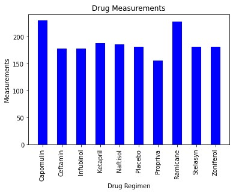
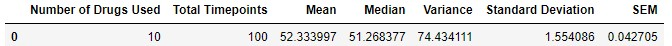
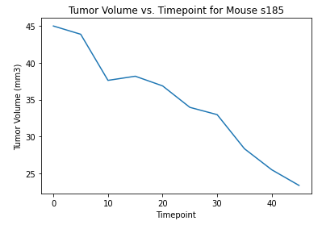
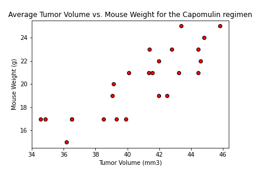
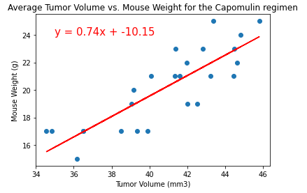

# Cancer Tumor Analysis using Matplotlib

Pymaceuticals Inc. is a burgeoning pharmaceutical company based out of San Diego that has conducted an study with 249 mice identified with SCC tumor growth, they were treated through a variety of drug regimens over the course of 45 days. 

### Dataset:

* [MouseMetadata](Pymaceuticals/data/Mouse_metadata.csv)
* [StudyResults](Pymaceuticals/data/Study_results.csv)

## Analysis:

[Analysis File](Pymaceuticals/pymaceuticals_starter.ipynb)

## Results:

The tumor development was observed and measured to compare the performance of Pymaceuticals' drug of interest, Capomulin, versus the other treatment regimens. The drugs used in this study are:

 

 The average tumor size in the study is 52.33 (mm3) as we can see in the following statistical summary:

  

  Over the course of the study, there was a clear improvement in the decrease of the tumor size on the mice that were treated with Capomulin. In the following graph we can see how the tumor size almost disappear for the mouse "s185"

 

 Data shows that the weight increase directly affect the size of the tumor, as we can see in the following graphic

 

The correlation between mouse weight and average tumor volume for the Capomulin regimen is 0.84 and it is represented in the following Linear Regression Model

 

